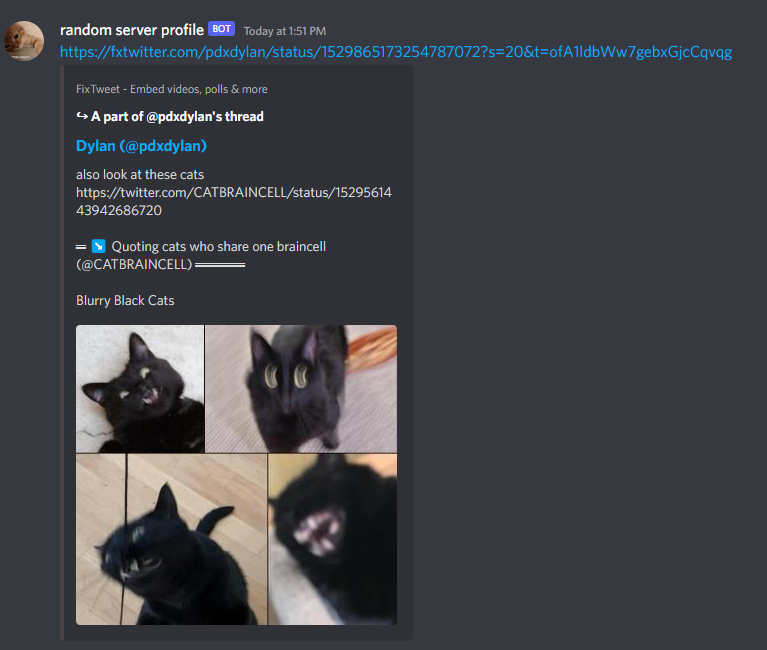

# Link Conversion Discord Bot 

A Discord bot that enhances your social media sharing experience by converting various social media links to their enhanced versions for better embeds in Discord. Originally designed for Twitter and Instagram, this bot now extends its functionality to convert any links, providing better embeds than the default ones. No commands are needed—simply add the bot to your server and start sharing. The bot will delete your original message and repost it using webhooks to mimic your display name and avatar, ensuring a seamless integration into your Discord conversations. Commands are available for further customization of its behaviour.

Learn more about the original link conversion features:
- FxTwitter: [FixTweet by dangeredwolf](https://github.com/dangeredwolf/FixTweet) - Enhances Twitter embeds.
- ddInstagram: [InstaFix by Wikidepia](https://github.com/Wikidepia/InstaFix) - Enhances Instagram embeds.

Invite the bot to your server using this link:
[Invite FxTwitter and ddInstagram Discord Bot](https://discord.com/api/oauth2/authorize?client_id=1015497909925580830&permissions=412854217728&scope=bot)

Join the support server for help and updates:
[Support Server Invite](https://discord.gg/6Cza4rW3y9)

Example of the bot in action:



This bot is now equipped to handle a wider range of links, providing enhanced embeds for a variety of platforms. 

**Configuration:**
You will need a JSON file in your root directory named `Config` with your bot access token in a `"TOKEN"` key and your application ID in a `"Client ID"` key.

```json
{
    "TOKEN": "your_bot_token_here",
    "Client ID": "your_application_id_here"
}
